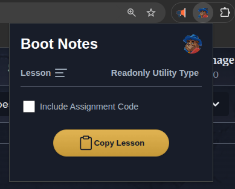

# boot-notes

A Chrome extension to convert [boot.dev](https://boot.dev) lessons to markdown and copy to clipboard for efficient note-taking in your favorite platform such as Obsidian or Notion.


* [Requirements](##requirements)
* [Installation](##installation)
* [Usage](##usage)
* [Background](##background)

## Background


[Boot.dev](https://boot.dev) has been my personal learning platform of choice for learning to code and improving my skills in backend development. I cannot say enough good things about the site. It's fun, interactive, makes learning addicting, and has a cool wizard bear named Boots.

Along my journey through their learning path I have taken rather meticulous notes on each lesson in order to reference later. I happen to use Obsidian as my app of choice and while working on lessons in boot.dev I am often copy and pasting lesson content and upon completion the code from assignments into my notes. However, this process is not ideal and often results in unwanted elements being copied requiring edits and ultimately delaying the process of learning the content. I have tried other plug-ins such as Obsidian Web Clipper with similar results requiring edits and unable to extract code from the assignments. 

All this led to me to write my own solution [boot-notes](# boot-notes). It extracts the boot.dev specific elements (`viewer` and `cm-line`) from the DOM and converts those inner HTML elements to markdown using `[turndown](https://github.com/mixmark-io/turndown)` and copy to the users clipboard.

## Requirements

node

## Installation

1. Clone the repository and cd into the directory:

```
git clone https://github.com/mattnickolaus/boot-notes.git && cd ./boot-notes
```

2. Install dependencies:

```
npm ci
```

3. Build the extension

```
npm run build
```

This outputs the build to the distribution directory. Make note of the `{repository file path}/dist`


4. Launch Chrome and click on the puzzle peice extension icon next to the search bar and then `Manage Extensions`.

5. In the top right corner turn on `Developer Mode`. This will reveal the `Load unpacked` button.

6. Click on `Load unpacked` and navigate to the repository file path and select the /dist directory.

Then you are all set to start using the chrome extension on [boot.dev](https://boot.dev) lessons.

## Usage

While on a boot.dev lesson click on the chrome extension icon.

Select the Boot Notes extension. And the popup below will be displayed:



You have the option to include the assignment code from the editor. If not you can simply hit `Copy Lesson` to extract the lesson content to your clipboard for your note-taking purposes.


